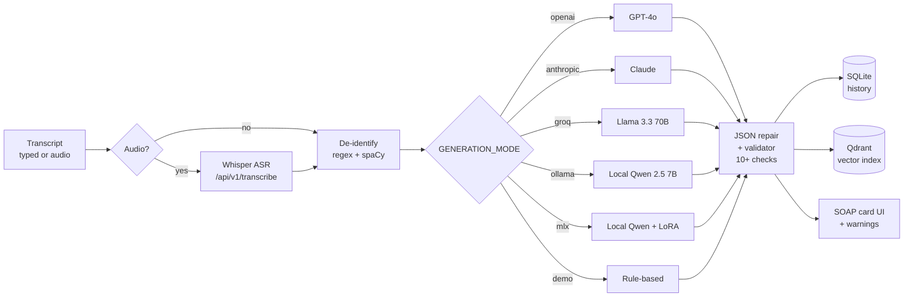
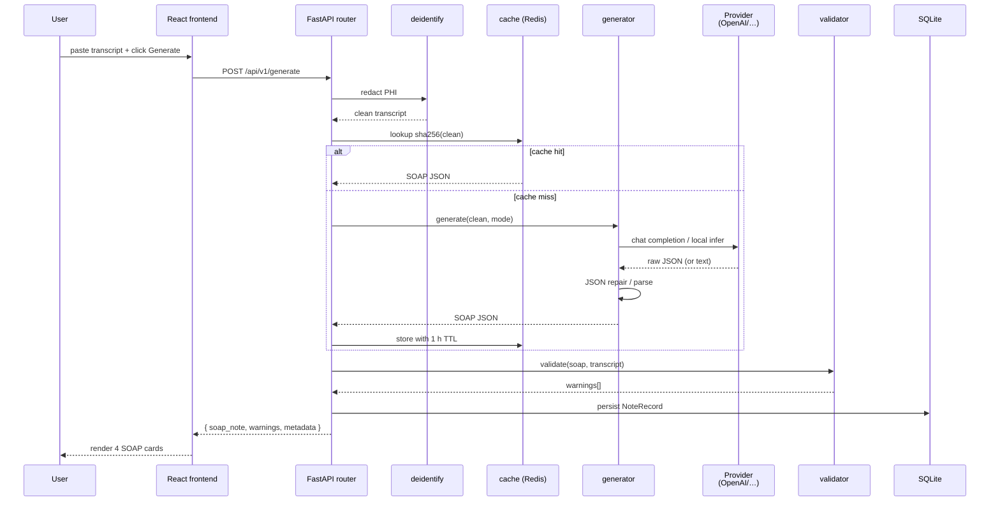
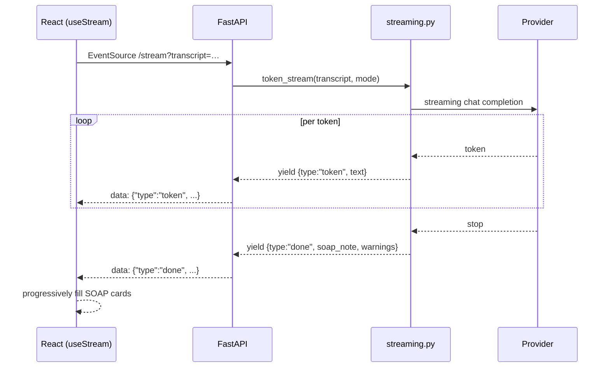
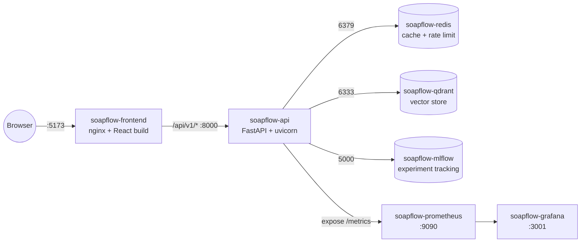
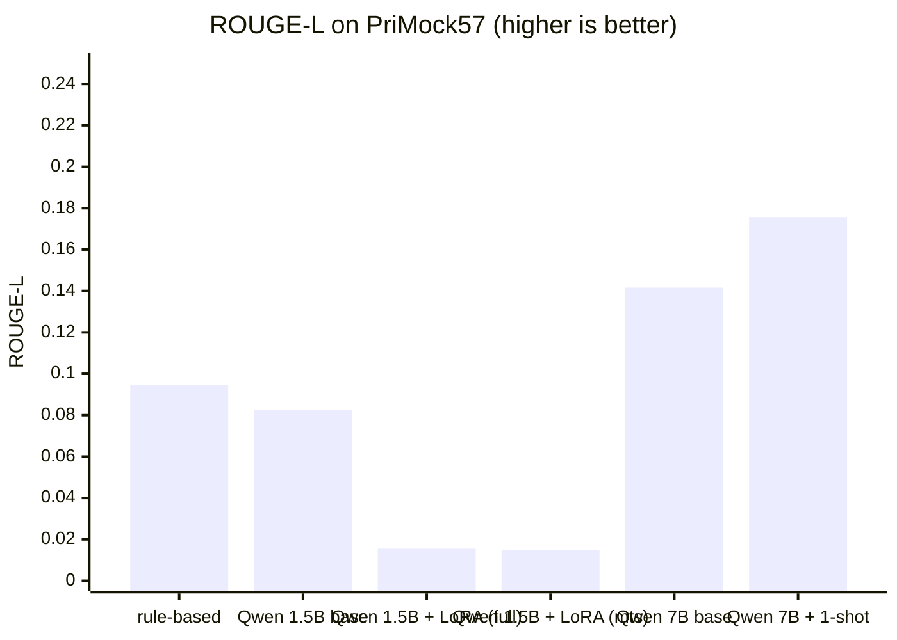
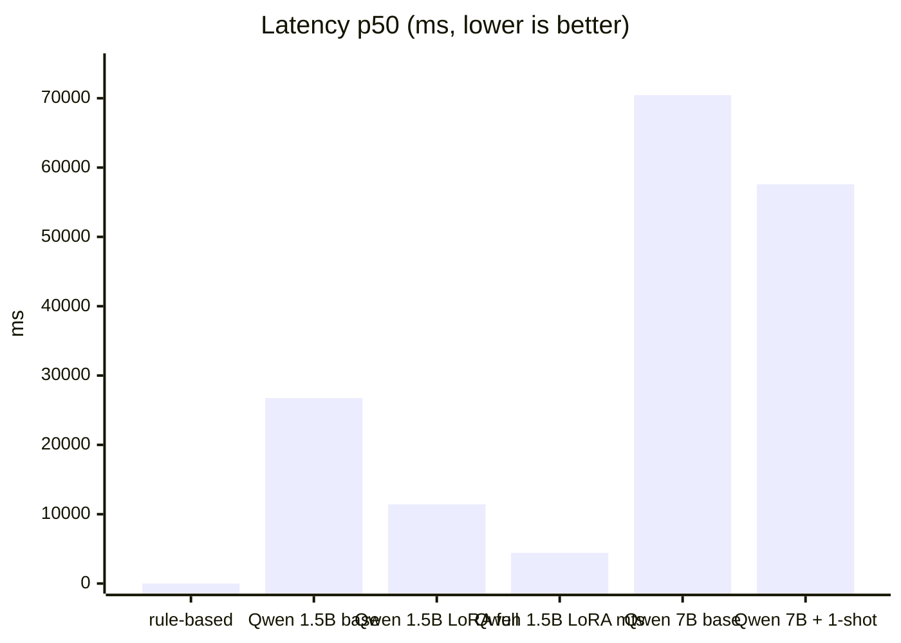

# SOAPFlow — Turn Doctor-Patient Conversations into SOAP Notes, Instantly


[](https://fastapi.tiangolo.com/)
[](https://react.dev/)
[](https://www.typescriptlang.org/)
[](https://python.org)
[](LICENSE)

> **SOAPFlow** converts raw doctor-patient conversation transcripts into structured, clinically formatted **SOAP notes** in seconds using state-of-the-art AI. Built for doctors, nurses, and clinical staff who need fast, accurate medical documentation.

---

## Table of Contents

- [Overview](#overview)
- [Features](#features)
- [Architecture](#architecture)
- [Quick Start](#quick-start)
- [Configuration](#configuration)
- [API Reference](#api-reference)
- [Frontend Guide](#frontend-guide)
- [Docker Deployment](#docker-deployment)
- [Development](#development)
- [Testing](#testing)
- [Fine-tuning](#fine-tuning)
- [Evaluation](#evaluation)
- [Contributing](#contributing)

---

## Overview

SOAP (Subjective, Objective, Assessment, Plan) notes are the universal standard for clinical documentation. Writing them manually after every patient visit is time-consuming. SOAPFlow automates this process by:

1. Accepting raw, unformatted conversation transcripts (typed or recorded → Whisper)
2. De-identifying PHI before any token leaves the box
3. Routing the transcript to one of six generation backends (hosted or local)
4. Returning a structured SOAP note with quality validation warnings
5. Persisting notes in a local history with vector search over past notes

**Supported AI Backends** (set with `GENERATION_MODE`, see [`backend/app/services/generator.py`](backend/app/services/generator.py)):

| Mode | Default model | Cost | Latency¹ | Notes |
|------|---------------|------|----------|-------|
| `openai` | `gpt-4o` | $$ | ~2.5 s | Highest quality. Requires `OPENAI_API_KEY`. |
| `anthropic` | `claude-opus-4-6` | $$$ | ~3 s | Highest quality. Requires `ANTHROPIC_API_KEY`. |
| `groq` | `llama-3.3-70b-versatile` | free² | ~1 s | Fastest hosted option. Requires `GROQ_API_KEY`. |
| `ollama` | `qwen2.5:7b` | free | ~30–60 s | Fully local. Needs `ollama serve` running. |
| `mlx` | `mlx-community/Qwen2.5-3B-Instruct-4bit` | free | ~10–20 s | Apple-Silicon only. Loads LoRA from `MLX_ADAPTER_PATH`. |
| `demo` | rule-based regex | free | <5 ms | No model. Always available. Used in CI + smoke tests. |

¹ Indicative on a typical PriMock57 transcript; not a benchmark. ² Groq has a free tier with rate limits.



---

## Features

### Core
- **One-click SOAP generation** from any conversation transcript
- **6 AI backends** — OpenAI, Anthropic, Groq, Ollama, MLX (local LoRA), demo
- **Token-by-token streaming** via SSE (`/api/v1/stream`)
- **Audio in** — `/api/v1/transcribe` accepts webm/mp3/wav/m4a (≤25 MB) via Whisper
- **PHI de-identification** — regex + spaCy NER, optional Presidio pass
- **Vector search** over past notes (Qdrant + ClinicalBERT embeddings)
- **Smart validation** — 10+ automated quality checks with severity levels (info / warning / error)
- **Note history** — SQLite persistence (CRUD) with audit log
- **Batch generation** — Up to 10 transcripts in one call
- **ROUGE + BLEU evaluation** harness with per-source breakdown
- **8 demo transcripts** across diverse clinical scenarios

### Frontend
- Split-panel layout (transcript input | SOAP output)
- Live word/character counter
- Formatted SOAP view + Raw JSON viewer
- History panel to browse and reload past notes
- Model selector — switch between any of the 6 backends per request
- Voice recorder with live waveform
- Export as plain text or JSON
- Print to PDF
- Toast notifications
- Fully responsive (mobile + desktop)

### API
- Auto-generated OpenAPI docs at `/docs`
- Request ID tracking
- CORS configuration
- Structured error responses

---

## Architecture

### System overview

```mermaid
flowchart TB
    subgraph Client["Browser (React 19 + Vite)"]
        UI[SOAP cards UI<br/>• TranscriptInput<br/>• OutputPanel<br/>• HistoryPanel]
        REC[VoiceRecorder<br/>+ waveform]
        HK[hooks: useGenerate<br/>useStream / useHistory]
    end

    subgraph API["FastAPI backend (port 8000)"]
        MW[Middleware<br/>CORS · auth · rate limit · request-id]
        R1[/api/v1/transcribe/]
        R2[/api/v1/generate/]
        R3[/api/v1/stream/ SSE]
        R4[/api/v1/history/]
        R5[/api/v1/search/]
        R6[/api/v1/evaluate/]
        R7[/api/v1/health, /stats, /demo, /auth/]
    end

    subgraph Services["Service layer"]
        S1[transcription<br/>Whisper]
        S2[deidentify<br/>regex + spaCy + Presidio]
        S3[generator<br/>6 backends]
        S4[validator<br/>10+ checks]
        S5[cache<br/>Redis or in-process]
        S6[search<br/>Qdrant + ClinicalBERT]
        S7[evaluator<br/>ROUGE / BLEU]
    end

    subgraph Stores["Stores"]
        DB[(SQLite / Postgres<br/>users · notes · audit)]
        Q[(Qdrant<br/>vector index)]
        RD[(Redis<br/>cache + rate limit)]
    end

    subgraph LLM["Model providers"]
        P1[OpenAI]
        P2[Anthropic]
        P3[Groq]
        P4[Ollama local]
        P5[MLX local + LoRA]
        P6[demo rule-based]
    end

    UI --> HK
    REC --> HK
    HK -->|HTTP / SSE| MW
    MW --> R1 & R2 & R3 & R4 & R5 & R6 & R7
    R1 --> S1
    R2 & R3 --> S2 --> S3 --> S4
    R4 --> DB
    R5 --> S6 --> Q
    R6 --> S7
    S3 --> S5 --> RD
    S3 --> P1 & P2 & P3 & P4 & P5 & P6
    S3 --> DB
```

### Repository layout

```
SOAPFlow/
├── backend/                       # FastAPI Python backend
│   ├── app/
│   │   ├── main.py                # App factory, router wiring, lifespan
│   │   ├── core/
│   │   │   ├── auth.py            # JWT (HS256) + bcrypt + roles
│   │   │   ├── config.py          # Pydantic Settings (all env vars)
│   │   │   ├── exceptions.py      # Custom HTTPException subclasses
│   │   │   ├── limiter.py         # Rate-limit middleware
│   │   │   ├── logging.py         # Structlog JSON logging
│   │   │   ├── metrics.py         # Prometheus counters / histograms
│   │   │   └── middleware.py      # Request-id, audit, CORS hooks
│   │   ├── api/routes/
│   │   │   ├── auth.py            # POST /auth/{register,login,refresh}, GET /auth/me
│   │   │   ├── transcribe.py      # POST /transcribe (audio → text)
│   │   │   ├── generate.py        # POST /generate, /batch-generate
│   │   │   ├── stream.py          # GET  /stream  (SSE token-by-token)
│   │   │   ├── history.py         # GET/POST/DELETE /history[/{id}]
│   │   │   ├── search.py          # POST /search (vector)
│   │   │   ├── evaluate.py        # POST /evaluate (ROUGE/BLEU)
│   │   │   ├── stats.py           # GET  /stats
│   │   │   ├── health.py          # GET  /health
│   │   │   └── demo.py            # GET  /demo-transcript[s/list]
│   │   ├── services/
│   │   │   ├── generator.py       # 6 backends + JSON repair + cache wiring
│   │   │   ├── streaming.py       # AsyncGenerator → SSE (OpenAI / Anthropic)
│   │   │   ├── transcription.py   # Whisper API client
│   │   │   ├── deidentify.py      # PHI redaction
│   │   │   ├── prompts.py         # System prompt + few-shot worked example
│   │   │   ├── validator.py       # 10+ rule-based quality checks
│   │   │   ├── evaluator.py       # ROUGE 1/2/L + BLEU + section coverage
│   │   │   ├── cache.py           # Redis with in-process fallback
│   │   │   └── search.py          # Qdrant + ClinicalBERT embeddings
│   │   ├── db/{database,models}.py# SQLAlchemy: User, SOAPNoteRecord, AuditLog
│   │   ├── schemas/{request,response,history}.py
│   │   ├── models/soap_model.py   # Domain model + ModelRegistry
│   │   └── utils/helpers.py
│   ├── tests/                     # pytest suite (health, generate, history, …)
│   ├── Dockerfile
│   └── requirements.txt
│
├── frontend/                      # React 19 + Vite + TypeScript + Tailwind
│   ├── src/
│   │   ├── App.tsx                # Root component + layout
│   │   ├── lib/{api,utils}.ts     # Fetch wrapper around /api/v1/*
│   │   ├── hooks/                 # useGenerate, useStream, useHistory, useToast
│   │   ├── components/
│   │   │   ├── soap/              # TranscriptInput, OutputPanel, SectionCard, …
│   │   │   ├── voice/             # VoiceRecorder + waveform
│   │   │   ├── history/           # HistoryPanel
│   │   │   ├── settings/          # SettingsPanel
│   │   │   ├── evaluation/        # EvaluationPanel
│   │   │   ├── layout/            # Navbar
│   │   │   ├── shared/            # ToastContainer
│   │   │   └── ui/                # shadcn-style primitives
│   │   ├── test/                  # Vitest suite
│   │   └── types/                 # Shared TS types
│   ├── Dockerfile
│   └── nginx.conf
│
├── scribe_datasets/adapters/      # Dataset adapters (not a brand name)
│   ├── base.py                    # BaseDatasetAdapter ABC
│   ├── synthetic_adapter.py       #  └ tier-0  hand-crafted seed examples
│   ├── mts_dialog_adapter.py      #  ├ tier-1  MTS-Dialog
│   ├── aci_bench_adapter.py       #  │         ACI-Bench
│   ├── primock57_adapter.py       #  │         PriMock57
│   ├── omi_health_adapter.py      #  ├ tier-2  omi-health
│   ├── notechat_adapter.py        #  │         NoteChat
│   ├── augmented_notes_adapter.py #  │         AGBonnet/augmented-clinical-notes
│   ├── meddialog_adapter.py       #  │         MedDialog
│   ├── mimic_note_adapter.py      #  └ tier-3  MIMIC-IV-Note (style only)
│   └── mtsamples_adapter.py       #            MTSamples       (style only)
│
├── data/                          # Raw + processed data (DVC-tracked, gitignored)
├── adapters/                      # Trained MLX LoRA adapters (config tracked, weights via DVC)
├── training/scripts/              # prepare_dataset, finetune_openai, finetune_mlx
├── evaluation/
│   ├── scripts/                   # batch_evaluate, compare_runs
│   ├── reports/                   # JSON reports + comparison.md
│   └── notebooks/                 # soap_evaluation.ipynb
├── scripts/                       # build_dataset_stack + setup/start + ablation runners
├── monitoring/prometheus.yml
├── docker-compose.yml             # backend · frontend · redis · qdrant · mlflow · prometheus · grafana
├── dvc.yaml                       # 11 stages (8 prepare + 1 splits + 1 evaluate + …)
└── docs/                          # ARCHITECTURE.md · NOTES.md
```

### Request lifecycle (`POST /api/v1/generate`)



### Streaming flow (`GET /api/v1/stream`)



---

## Quick Start

### Prerequisites
- Python 3.11+
- Node.js 18+
- (Optional) OpenAI or Anthropic API key

### 1. Clone & Configure

```bash
git clone https://github.com/sushildalavi/SOAPFlow.git
cd SOAPFlow
```

### 2. Backend Setup

```bash
cd backend

# Create virtual environment
python -m venv venv
source venv/bin/activate        # macOS/Linux
# venv\Scripts\activate         # Windows

# Install dependencies
pip install -r requirements.txt

# Configure environment
cp .env.example .env
# Edit .env and add your API keys (optional — demo mode works without them)

# Start the API server
uvicorn app.main:app --reload --port 8000
```

The API will be available at `http://localhost:8000`
- Swagger docs: `http://localhost:8000/docs`
- ReDoc: `http://localhost:8000/redoc`

### 3. Frontend Setup

```bash
cd frontend

# Install dependencies
npm install

# Start development server
npm run dev
```

The app will be available at `http://localhost:5173`

### One-command setup (macOS/Linux)

```bash
bash scripts/setup.sh
```

---

## Configuration

All configuration is via environment variables in `backend/.env`. Canonical
list lives in [`backend/app/core/config.py`](backend/app/core/config.py); the
example file is [`backend/.env.example`](backend/.env.example).

```env
# ─── AI provider keys (at least one recommended for production) ──
OPENAI_API_KEY=sk-...
ANTHROPIC_API_KEY=sk-ant-...
GROQ_API_KEY=gsk_...

# ─── Generation mode ────────────────────────────────────────────
# One of: openai | anthropic | groq | ollama | mlx | demo
# Auto-promoted from "demo" → "openai"/"anthropic" if a key is set.
GENERATION_MODE=demo

# ─── Hosted model selection (defaults shown) ────────────────────
OPENAI_MODEL=gpt-4o
ANTHROPIC_MODEL=claude-opus-4-6
GROQ_MODEL=llama-3.3-70b-versatile

# ─── Local Ollama ───────────────────────────────────────────────
OLLAMA_MODEL=qwen2.5:7b
OLLAMA_BASE_URL=http://localhost:11434
OLLAMA_TIMEOUT_S=600

# ─── Local MLX (Apple Silicon) ──────────────────────────────────
MLX_MODEL=mlx-community/Qwen2.5-3B-Instruct-4bit
MLX_ADAPTER_PATH=adapters/qwen2.5-1.5b-instruct-4bit_v2_full
MLX_MAX_TOKENS=2048
MLX_MAX_TRANSCRIPT_CHARS=6000

# ─── App / DB / CORS ────────────────────────────────────────────
APP_VERSION=1.0.0
DEBUG=false
DATABASE_URL=sqlite:///./soapflow.db    # use postgresql+psycopg://… in prod
ALLOWED_ORIGINS=["http://localhost:5173","http://localhost:3000"]

# ─── Input limits ───────────────────────────────────────────────
MAX_TRANSCRIPT_LENGTH=20000
MIN_TRANSCRIPT_LENGTH=50
```

**Auto-promotion:** when `GENERATION_MODE=demo` but a hosted key is set,
the dispatcher upgrades to `openai` → `anthropic` → `groq` (in that order
of preference) at request time. Local modes (`ollama`, `mlx`) are never
auto-selected — set them explicitly.

---

## API Reference

### Health

```
GET /api/v1/health
```
Returns server status, API configuration, and active generation mode.

**Response:**
```json
{
  "status": "ok",
  "version": "1.0.0",
  "generation_mode": "openai",
  "openai_configured": true,
  "anthropic_configured": false
}
```

---

### Generate SOAP Note

```
POST /api/v1/generate
```

**Request Body:**
```json
{
  "transcript": "Doctor: What brings you in today?\nPatient: I've had a headache...",
  "include_raw_json": true,
  "mode": null
}
```

| Field | Type | Required | Description |
|-------|------|----------|-------------|
| `transcript` | string | Yes | Raw conversation text (50–20,000 chars) |
| `include_raw_json` | boolean | No | Return raw JSON in response (default: true) |
| `mode` | string \| null | No | Override: `"openai"` \| `"anthropic"` \| `"groq"` \| `"ollama"` \| `"mlx"` \| `"demo"` |

**Response:**
```json
{
  "success": true,
  "soap_note": {
    "subjective": "Patient reports 3-day headache...",
    "objective": "BP 120/80, HR 72, temp 98.6°F...",
    "assessment": "Tension-type headache, likely stress-related...",
    "plan": "1. Ibuprofen 400mg TID PRN pain..."
  },
  "warnings": [
    {
      "code": "MISSING_OBJECTIVE_DATA",
      "message": "Objective section may be missing measurable clinical data.",
      "severity": "info",
      "field": "objective"
    }
  ],
  "metadata": {
    "model": "gpt-4o",
    "mode": "openai",
    "transcript_word_count": 342,
    "transcript_char_count": 2180,
    "note_word_count": 98,
    "processing_time_ms": 2341.5,
    "sections_populated": 4
  }
}
```

---

### Batch Generate

```
POST /api/v1/batch-generate
```

Process up to 10 transcripts in a single request.

```json
{
  "transcripts": ["Doctor: ...", "Doctor: ..."]
}
```

---

### History

```
GET    /api/v1/history              # List all saved notes
POST   /api/v1/history              # Save a note
GET    /api/v1/history/{id}         # Get a specific note
DELETE /api/v1/history/{id}         # Delete a note
DELETE /api/v1/history              # Clear all history
```

**Save Note Request:**
```json
{
  "transcript": "...",
  "soap_note": { "subjective": "...", ... },
  "metadata": { "model": "gpt-4o", ... },
  "title": "Optional custom title"
}
```

---

### Evaluate

```
POST /api/v1/evaluate
```

Score a generated note against a reference using ROUGE/BLEU metrics.

```json
{
  "transcript": "...",
  "generated_note": { "subjective": "...", ... },
  "reference_note": { "subjective": "...", ... }
}
```

---

### Demo Transcripts

```
GET /api/v1/demo-transcripts/list   # List available demo cases
GET /api/v1/demo-transcript?index=0 # Get specific demo transcript
```

Available demos:
| Index | Title | Scenario |
|-------|-------|----------|
| 0 | Hypertension Follow-Up | Type 2 DM + HTN management |
| 1 | Acute Respiratory | Community-acquired pneumonia |
| 2 | Pediatric Well Visit | 6-year well-child check |
| 3 | Mental Health Consult | Depression screening |
| 4 | Emergency Chest Pain | Acute MI workup |
| 5 | Chronic Pain | Fibromyalgia management |
| 6 | Orthopedic Consult | Knee injury evaluation |
| 7 | Diabetes New Onset | Type 2 DM initial presentation |

---

## Frontend Guide

### Generate a SOAP Note
1. Paste your transcript in the left panel
2. (Optional) Select AI model from the dropdown
3. Click **Generate SOAP Note**
4. Review the formatted note, warnings, and metadata in the right panel

### History Panel
- Click the **History** icon in the navbar to open the history sidebar
- Previous notes are grouped by date
- Click any note to reload it in the output panel
- Delete individual notes or clear all history

### Export Options
- **Text** — Downloads a formatted `.txt` file
- **JSON** — Downloads structured SOAP data as `.json`
- **Print** — Opens browser print dialog (optimized for PDF export)

### Model Selector
Use the model dropdown in the transcript input panel to override the server's default generation mode on a per-request basis.

---

## Docker Deployment

### Topology



### Full stack (recommended)

```bash
# Copy and configure environment
cp backend/.env.example backend/.env
# Edit backend/.env with your API keys

# Start everything
docker-compose up --build
```

| Service | URL | Container |
|---------|-----|-----------|
| Frontend (SPA) | http://localhost:5173 | `soapflow-frontend` |
| Backend API | http://localhost:8000 | `soapflow-api` |
| API docs (Swagger) | http://localhost:8000/docs | — |
| API docs (ReDoc) | http://localhost:8000/redoc | — |
| Qdrant dashboard | http://localhost:6333/dashboard | `soapflow-qdrant` |
| MLflow UI | http://localhost:5000 | `soapflow-mlflow` |
| Prometheus | http://localhost:9090 | `soapflow-prometheus` |
| Grafana | http://localhost:3001 | `soapflow-grafana` (admin / soapflow) |

### Backend Only

```bash
cd backend
docker build -t soapflow-api .
docker run -p 8000:8000 --env-file .env soapflow-api
```

---

## Development

### Backend Development

```bash
cd backend
source venv/bin/activate
uvicorn app.main:app --reload --port 8000
```

The server auto-reloads on file changes. The SQLite database (`soapflow.db`) is created automatically in the `backend/` directory on first run.

### Frontend Development

```bash
cd frontend
npm run dev
```

The Vite dev server proxies all `/api` requests to `http://localhost:8000`.

### Adding a New AI Backend

1. Add an `_generate_<mode>(transcript, ...)` async function in [`backend/app/services/generator.py`](backend/app/services/generator.py).
2. Extend the `generation_mode: Literal["openai", "anthropic", "ollama", "groq", "mlx", "demo", "<your_mode>"]` literal in [`backend/app/core/config.py`](backend/app/core/config.py).
3. Wire it into the dispatcher in `generate_soap()` (the big `if mode == ...` block) and add any new env vars to `Settings`.
4. Add the env var(s) to [`backend/.env.example`](backend/.env.example) and the table at the top of this README.
5. If the backend supports streaming, also wire it into [`backend/app/services/streaming.py`](backend/app/services/streaming.py) so `/api/v1/stream` works for it.

---

## Testing

### Backend Tests

```bash
cd backend
source venv/bin/activate
pytest tests/ -v
```

Test coverage:
- `test_health.py` — Health endpoint
- `test_generate.py` — SOAP generation (demo mode)
- `test_validation.py` — Transcript and note validation
- `test_history.py` — History CRUD operations
- `test_evaluate.py` — Evaluation scoring
- `test_demo.py` — Demo transcript endpoints

### Frontend Tests

```bash
cd frontend
npm run test
```

---

## Fine-tuning

Two paths are supported: **OpenAI** (hosted) and **MLX** (local LoRA on
Apple Silicon).

### Pipeline overview

```mermaid
flowchart LR
    subgraph Sources["Public sources"]
        S1[MTS-Dialog]
        S2[ACI-Bench]
        S3[PriMock57]
        S4[NoteChat]
        S5[omi-health]
        S6[Augmented<br/>Clinical Notes]
        S7[MIMIC-IV-Note]
        S8[MTSamples]
    end
    Sources -->|adapter normalises<br/>to transcript+SOAP| P[scribe_datasets/<br/>adapters/*]
    P --> B[scripts/<br/>build_dataset_stack.py]
    B --> SP[data/splits/<br/>train · val · test · style]
    SP --> T1[training/scripts/<br/>finetune_openai.py]
    SP --> T2[training/scripts/<br/>finetune_mlx.sh]
    T1 --> A1[OpenAI fine-tuned<br/>checkpoint]
    T2 --> A2[adapters/<br/>qwen2.5-1.5b-…/]
    A1 & A2 --> E[evaluation/scripts/<br/>batch_evaluate.py]
    E --> R[evaluation/reports/<br/>results_*.json]
    R --> C[evaluation/scripts/<br/>compare_runs.py]
    C --> CMD[comparison.md]
```



### OpenAI

```bash
# 1. Build a JSONL training file (default --source synthetic, --output data/training.jsonl)
python training/scripts/prepare_dataset.py --source mts_dialog --count 500 \
       --output data/training.jsonl

# 2. Submit the fine-tune job
python training/scripts/finetune_openai.py --data data/training.jsonl

# 3. Check job status
python training/scripts/finetune_openai.py --check --job-id ftjob-xxxxxxxxxxxxxxxx

# 4. List recent jobs
python training/scripts/finetune_openai.py --list
```

Hyperparameters live in [`training/configs/openai_finetune.json`](training/configs/openai_finetune.json).
Optional `--mlflow` flag tracks the run.

### MLX (local LoRA)

```bash
# 1. Build MLX-shaped training data
python training/scripts/prepare_mlx_data.py

# 2. Run the fine-tune script (wraps mlx_lm.lora)
bash training/scripts/finetune_mlx.sh

# 3. Point the backend at the freshly trained adapter
export GENERATION_MODE=mlx
export MLX_ADAPTER_PATH=adapters/qwen2.5-1.5b-instruct-4bit_v2_full
uvicorn app.main:app --app-dir backend --reload
```

The repo ships with three trained adapters (configs only — weights via DVC):

| Adapter | Base | Trained on | LoRA r / α |
|---------|------|-----------|------------|
| `adapters/qwen2.5-1.5b-instruct-4bit_full` | Qwen 2.5 1.5B Instruct (4-bit) | mixed (full split) | 8 / 20 |
| `adapters/qwen2.5-1.5b-instruct-4bit_v2_full` | Qwen 2.5 1.5B Instruct (4-bit) | mixed v2 (cleaner labels) | 8 / 20 |
| `adapters/qwen2.5-1.5b-instruct-4bit_mts` | Qwen 2.5 1.5B Instruct (4-bit) | MTS-Dialog only | 8 / 20 |

---

## Evaluation

### Dataset stack

SOAPFlow is trained and evaluated against a tiered dataset stack defined in
[`scribe_datasets/adapters/__init__.py`](scribe_datasets/adapters/__init__.py).
Each adapter normalizes its source into `(transcript, soap_note)` pairs.

| Tier | Datasets | Role |
| --- | --- | --- |
| **Gold (real dialogue ↔ note)** | ACI-Bench, MTS-Dialog, PriMock57 | benchmark + train |
| **Synthetic augmentation** | NoteChat, Augmented Clinical Notes, omi-health | scale |
| **Style/format only** | MIMIC-IV-Note, MTSamples | note adaptation |

See [`data/README.md`](data/README.md) for per-dataset paths and licensing.

### Build splits

```bash
python scripts/build_dataset_stack.py --output-dir data/splits
```

The script is best-effort — missing datasets are reported and skipped, and
`data/splits/manifest.json` records what was built and what was missing.

### Headline result

Best free run today: **Qwen 2.5 7B + 1-shot worked example** scoring
0.176 ROUGE-L / 0.322 ROUGE-1 on PriMock57 (n=57) — 1.85× the
rule-based baseline, 1.24× the same model with no few-shot, $0 in
API spend. Full table in
[`evaluation/reports/comparison.md`](evaluation/reports/comparison.md).





### Run it yourself

Free local path with [Ollama](https://ollama.com/):

```bash
ollama pull qwen2.5:7b
GENERATION_MODE=ollama OLLAMA_MODEL=qwen2.5:7b \
  uvicorn app.main:app --app-dir backend
python evaluation/scripts/batch_evaluate.py \
  --dataset data/splits/test.jsonl \
  --output evaluation/reports/results.json \
  --mode ollama \
  --per-source
```

`--per-source` breaks ROUGE-L / sections-populated out by dataset (PriMock57,
ACI-Bench, etc.) so ablations stay honest.

Jupyter notebook for interactive analysis:

```bash
cd evaluation/notebooks
jupyter notebook soap_evaluation.ipynb
```

---

## Contributing

See [CONTRIBUTING.md](CONTRIBUTING.md) for the full guide. The short
version:

1. Fork the repository
2. Branch off `main`: `git checkout -b feature/your-feature`
3. Make your changes with tests
4. Run the test suites: `cd backend && pytest -q` and `cd frontend && npm test`
5. Open a PR against `main`

### Code style
- **Python:** Ruff + Black (line length 100), type hints throughout.
- **TypeScript:** ESLint with the project config; no separate Prettier.
- **Commits:** short, lowercase, imperative — `fix history pagination`,
  `bump fastapi`, `tighten phi regex`. We don't use Conventional Commits.

---

## License

MIT License — see [LICENSE](LICENSE) for details.

---

## Acknowledgements

Built with [FastAPI](https://fastapi.tiangolo.com/), [React](https://react.dev/), [Tailwind CSS](https://tailwindcss.com/), [OpenAI](https://openai.com/), [Anthropic Claude](https://anthropic.com/), [Ollama](https://ollama.com/), and [Radix UI](https://radix-ui.com/).

Datasets: [ACI-Bench](https://physionet.org/content/aci-bench/), [MTS-Dialog](https://github.com/abachaa/MTS-Dialog), [PriMock57](https://github.com/babylonhealth/primock57), [NoteChat](https://huggingface.co/datasets/akemiH/NoteChat), [Augmented Clinical Notes](https://huggingface.co/datasets/AGBonnet/augmented-clinical-notes), [omi-health](https://huggingface.co/datasets/omi-health/medical-dialogue-to-soap-summary), [MIMIC-IV-Note](https://physionet.org/content/mimic-iv-note/), [MTSamples](https://www.kaggle.com/datasets/tboyle10/medicaltranscriptions).
